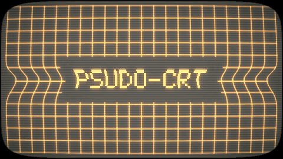

# psudo-crt



A procedural amber CRT, rendered from nothing but arithmetic — a test grid on a
simulated tube, with a **pinch**: a band where the horizontal scan amplitude
collapses, rolling slowly up the screen. It is what a monitor does when ripple
gets into the supply rail feeding the horizontal output stage.

Output is a seamless loop, for use as B-roll, title cards and transitions.

## Install

Python 3.9+ and two packages. Nothing lands system-wide — `imageio-ffmpeg`
brings its own ffmpeg binary, so there is no Homebrew ffmpeg to install and
nothing to put on your `PATH`.

```sh
git clone git@github.com:dev-dull/psudo-crt.git
cd psudo-crt
python3 -m venv venv
./venv/bin/pip install -r requirements.txt
```

The versions in `requirements.txt` are pinned to the ones the sample was
rendered with. `pip install numpy imageio-ffmpeg` works just as well if you
would rather take the current releases.

If you ever need that bundled ffmpeg directly — the GIF recipe below does:

```sh
./venv/bin/python -c "import imageio_ffmpeg; print(imageio_ffmpeg.get_ffmpeg_exe())"
```

## Usage

```sh
./venv/bin/python crt_pinch.py -o out.mp4
```

That is a 16-second 1080p60 loop, and it takes a few minutes. **Iterate on a
single frame instead** — a still is about two seconds:

```sh
./venv/bin/python crt_pinch.py --still look.png --still-phase 0.35
```

`--still-phase` is where in the loop to freeze, in `[0,1]`. Use it to put the
band where you want it before committing to a render.

Every output is a **seamless loop**: the fault profile is periodic over exactly
one screen height, so the last frame runs into the first with no jump. Loop it
end to end for as long as you need.

### Filling the frame

By default the picture sits inside a rounded-rectangle glass aperture, so the
frame corners are black — right for a shot of a tube, wrong for a full-frame
backdrop. For an edge-to-edge picture:

```sh
./venv/bin/python crt_pinch.py -o full.mp4 --square-corners --inset 0
```

Add `--vignette 0` if you want the corners at full brightness too. Under
`--pillarbox` the 4:3 side bars stay put — `--square-corners` squares the
aperture, it does not widen the picture.

### Phosphor

Amber (P3) is the default; `--phosphor green` gives the yellow-green P31
terminal instead.

```sh
./venv/bin/python crt_pinch.py -o green.mp4 --phosphor green
```

Each entry in the `PHOSPHORS` table at the top of the script carries four
colours — unlit glass, trace, the shift added where the beam is driven past
full, and the halation tint — so switching moves the whole tube together
rather than just hue-rotating the traces. Add a table entry and it appears in
`--phosphor` automatically.

### Text — title screens and transitions

```sh
# title card over the grid, with the grid cleared out behind the words
./venv/bin/python crt_pinch.py -o title.mp4 --text-box \
    --text 'QUESTIONABLE COMMANDS\n\nEPISODE 03: THE PINCHED RASTER'

# bare terminal, left aligned, blinking block cursor on the empty last line
./venv/bin/python crt_pinch.py -o boot.mp4 --no-grid --text-align left --cursor \
    --text 'C:\> RUN DIAGNOSTIC\n\nHORIZ SCAN ....... FAIL\nB+ RIPPLE ........ 4.2V\n'
```

The text is part of the **signal**, not an overlay pasted on afterwards, so the
travelling fault stretches and shoves the characters exactly as it does the
grid, the scanlines cut through them, and they bloom into the halation. Put a
line where the pinch passes and watch it get mangled.

### More than one block

`--text` can be repeated. Each occurrence starts a new block, and the text
options *after* it belong to that block — so blocks can differ in size,
position, alignment and brightness. That is how you mix sizes on one card:

```sh
./venv/bin/python crt_pinch.py -o title.mp4 --no-grid \
    --text 'QUESTIONABLE\nCOMMANDS' --text-size 0.10 --text-y -0.23 \
    --text '$?'                     --text-size 0.18 --text-y 0.25
```

Options given *before* the first `--text` set the default for every block, so
the single-block spelling still works whatever order you write it in.

Blocks are independent, and every `--text-box` is cleared before any characters
are laid down — so a box belonging to one block can never rub out a neighbour's
text, however much they overlap.

### Rendering GIFs

Render GIFs from **their own grain-free pass** at the target resolution. Film
grain changes every pixel of every frame, which defeats GIF's inter-frame
compression — it was worth 60 MB on the first attempt here.

```sh
FF=$(./venv/bin/python -c "import imageio_ffmpeg; print(imageio_ffmpeg.get_ffmpeg_exe())")

./venv/bin/python crt_pinch.py -o gif_src.mp4 --width 960 --height 540 \
    --fps 12 --grain 0 --scanlines 140 --glow-px 3 --line-px 1.2 --crf 8

"$FF" -i gif_src.mp4 -vf "split[a][b];[a]palettegen=max_colors=32:stats_mode=diff[p];\
[b][p]paletteuse=dither=bayer:bayer_scale=4:diff_mode=rectangle" -loop 0 out.gif
```

Scanline count is tied to *pixel height*, not to the tube: `--scanlines 140` at
540p keeps the raster looking the way `280` does at 1080p. Skip that and
downscaling moirés the raster.

Measured sizes at 960×540, 16 s: 64 colours ≈ 11 MB, 32 ≈ 8.1 MB, 24 ≈ 7.1 MB;
32 colours at 10 fps ≈ 7.0 MB. Thirty-two costs nothing visible — the image is
a single hue on grey. To go smaller, drop the resolution and **re-render**,
don't downscale.

## Flags

| Flag | Default | Effect |
|---|---|---|
| `-o`, `--output` | `crt_pinch.mp4` | Output video path |
| `--width` / `--height` | `1920` / `1080` | Output resolution |
| `--fps` | `60` | Frame rate |
| `--period` | `16` | Seconds to travel one screen height (= loop length) |
| `--direction` | `1` | `1` rolls up, `-1` rolls down |
| `--phosphor` | `amber` | `amber` (P3) or `green` (P31) |
| `--pinch` | `0.075` | How hard the scan narrows. `0.15` is a badly sick set |
| `--band` | `0.22` | Height of the disturbed region |
| `--asym` | `0.55` | Sharpness above the band vs below; `1.0` is symmetric |
| `--ring` | `1.5` | Ringing wavelength — lower gives more lobes above and below |
| `--vshift` | `0.022` | How much the band pulls the picture down as well as in |
| `--rows` / `--cols` | `12` / auto | Grid density; `--cols 0` fills the width with square cells |
| `--fill` | `0.93` | Grid height as a fraction of screen height |
| `--pincushion` | `0.022` | Static geometry error, independent of the fault |
| `--overscan` | `1.25` | Raster size / screen size |
| `--inset` | `0.012` | Thin dark border around the picture; `0` removes it |
| `--corner` | `8.0` | Corner squareness of the glass aperture |
| `--square-corners` | off | Picture fills the frame corners, no rounded black |
| `--pillarbox` | off | 4:3 picture with black sides |
| `--scanlines` | `280` | Visible raster lines. Raise for a higher-res-looking monitor |
| `--scan-depth` | `0.40` | How dark the gaps between scanlines go |
| `--line-px` | `1.55` | Grid trace width, in pixels |
| `--glow` | `0.42` | Halation around the traces |
| `--glow-px` | `6.0` | Halation radius, in pixels |
| `--vignette` | `0.22` | Corner falloff |
| `--grain` | `0.010` | Film grain. Set `0` for GIF sources |
| `--crf` | `14` | x264 quality; lower is bigger and cleaner |
| `--still` | — | Render a single PNG instead of a video |
| `--still-phase` | `0.5` | Where in the loop the still is taken, `[0,1]` |

### Text flags

| Flag | Default | Effect |
|---|---|---|
| `--text` | none | The text. `\n` splits lines; blank lines are fine. Repeatable — see above |
| `--text-size` | `0.075` | Character cell height as a fraction of screen height |
| `--text-x` / `--text-y` | `0` / `0` | Offset from centre, in `[-1,1]`; `+y` is down |
| `--text-align` | `center` | `center` or `left`, within a block |
| `--text-bright` | `1.0` | Below `1` for a dimmer, less blown-out trace |
| `--text-box` | off | Clear the grid out behind the text block |
| `--text-margin` | `0.6` | `--text-box` padding, in character cells |
| `--no-grid` | — | Drop the grid entirely: text on a bare raster |
| `--cursor` | off | Blinking block cursor after the last line |
| `--cursor-hz` | `1.7` | Blink rate, snapped so it stays loop-seamless |

## How it works

Nothing is warped from a source bitmap. Every pixel is evaluated analytically,
so the output is sharp at any resolution. Per frame:

1. Screen pixels map through a mild **pincushion** into tube coordinates.
2. The **fault profile** `f` is an oscillation under a bi-gaussian window,
   evaluated at each pixel's distance from the travelling band. Wrapped copies
   are summed so it comes out exactly periodic — that is what makes the loop
   seamless.
3. Horizontal scan gain becomes `1 - pinch·f`, so signal-space `u = x / gain`.
   The grid is **finite**, so where the scan narrows, the picture's own edges
   pull inward instead of dragging extra lines in from off-screen.
4. Distance to the nearest grid line is converted back into *screen* space
   before it becomes a brightness, so traces keep their width no matter how
   compressed the region is.
5. Text is sampled from the glyph page at those same signal-space coordinates,
   so the fault warps it like everything else, then it is added to the beam.
6. Scanline structure, beam-current bloom in the compressed band, halation,
   vignette, rounded glass and grain go on last.

### The font

A 5×7 glyph in an 8×8 cell, held as one byte per scan row with bit `0x80`
leftmost — the layout a character-generator ROM of the period used. Full
printable ASCII, with real descenders on `g j p q y`. It is a table in the
script rather than a font file, so there is nothing to install and it renders
as crisp phosphor blocks at any output resolution.

It was authored by hand, so proof the set after touching a glyph — one bad `3`
already got through and was caught this way:

```sh
./venv/bin/python crt_pinch.py --still proof.png --no-grid --text-size 0.058 \
  --text '!"#$%&'"'"'()*+,-./0123456789:;<=>?\n@ABCDEFGHIJKLMNOPQRSTUVWXYZ[\]^_\n`abcdefghijklmnopqrstuvwxyz{|}~'
```

## Notes for anyone changing the model

Each of these was a wrong turn first, and none of the symptoms are obvious from
the code.

- **The grid must stay finite.** With an infinite grid, narrowing the scan drags
  *extra* columns in from off-screen — the opposite of a pinch.
- **The tube overscans**, deliberately. Without it the pinch pulls the raster
  edge into view and takes black bites out of the sides of the picture. Real
  sets overscan; so does this one.
- **Line width is converted to screen space** before it becomes brightness. Skip
  that and traces thin out inside the compressed band, which reads as a focus
  error rather than a geometry error.
- **The fault profile must stay C¹ continuous.** An earlier attempt used a hard
  one-sided step to get a sharp leading edge, and it *tears* the grid — a
  visible sideways jump, like a roll bar. The bi-gaussian window gives the
  asymmetry without the tear.
- **The FFT blur must be zero-padded.** Unpadded, it wraps glow from one edge
  onto the opposite one and paints a bright rim around the frame.
- **A bright rim at the screen edge may be an illusion.** Measured, the margin
  is *darker* (57) than the interior (91) — it only looks lighter against the
  black bezel. Measure pixels before chasing it.
- **Anything time-varying you add must divide evenly into the loop**, or the
  seam comes back. The cursor already does: `--cursor-hz` snaps to a whole
  number of blinks.

## A note on the rendered files

Video and GIF output is **gitignored**. The renders are large — the original
set ran to about 200 MB — and they are reproducible from the script, so they
are not in the repository. The one exception is `docs/sample.gif` above.

## The name

Not `pseudo`. `psudo`.

`PSEUDOCRT` is nine characters. An 8.3 filename gets you eight. Something had
to go, and it was never going to be a consonant — the convention of the era was
to keep the letters that carry the sound and let the vowels take the hit, which
is how the same decade produced `CHKDSK`, `XCOPY`, `MSCDEX` and `QBASIC`. Drop
the `e` and you get `PSUDOCRT`: eight on the nose, no truncation, and it still
fits on a diskette label without wrapping.

What falls out is better than what was intended. Phosphors are catalogued by a
`P` and a number — P3 the amber, P31 the green terminal, P4 the paper-white
television. Two of those are entries in the `PHOSPHORS` table already and the
third is [issue #1](https://github.com/dev-dull/psudo-crt/issues/1). Read the
name that way and it is one more designation in the same list: `P`, and then,
where the number belongs, an admission. There is no phosphor. Nothing in here
glows. It is arithmetic that has been told what glowing looks like.

The vowel is not lost, exactly. It went the way of everything else that passes
through the horizontal output stage on a set with ripple in the rail.

## Why

The fault is the one Adrian pulls apart in [this Adrian's Digital Basement
video](https://www.youtube.com/watch?v=9d0jgdrljHU), which is where the idea
came from. I wanted the look as footage I could actually cut with — at
arbitrary resolution, with my own text on it, looping cleanly — so rather than
filming a sick monitor, this reproduces the fault from its geometry.

It exists to be used on my YouTube channel,
[Questionable Commands](https://www.youtube.com/@questionablecommands).
